# Arquitectura de DockPulse

## Vista de despliegue

El SVG está versionado para que el diagrama se vea también en lectores Markdown sin soporte Mermaid. La fuente editable está en [`architecture.mmd`](architecture.mmd).

El control plane no monta ningún Docker socket. Cada agente es una frontera de ejecución local: descubre e inspecciona mediante el socket de su propio host, valida operaciones del dominio y devuelve inventario y eventos. Registro, heartbeat y eventos son salientes desde el agente; refresh, dry-run y update entran a la API del agente. Este modelo exige conectividad del control plane hacia el puerto del agente. Una variante pull-only queda como fase 2 para redes con NAT estricto.

## Separación de responsabilidades

| Capa          | Responsabilidad                                      | No hace                              |
| ------------- | ---------------------------------------------------- | ------------------------------------ |
| Discovery     | `docker inspect`, clasificación Compose/run, digests | No ejecuta updates                   |
| Evaluation    | Registry manifest digest, labels y política sensible | No asume que `latest` es seguro      |
| Execution     | Plan validado, Compose o recreación transaccional    | No acepta shell/comandos arbitrarios |
| Control plane | Estado global, locks, auditoría, dispatch            | No toca sockets Docker               |
| Web           | Presentación y confirmaciones                        | No contiene reglas de negocio        |

## Flujo de actualización

1. La UI solicita un dry-run; el control crea un job y firma la solicitud al agente.
2. El agente vuelve a inspeccionar el objetivo y aplica sus propias guardas. La autorización no depende de datos viejos del control.
3. Para Compose ejecuta `pull` y `up -d` con proyecto, directorio y servicio como argumentos separados.
4. Para `docker run`, hace pull, detiene y renombra el original, crea el reemplazo, conecta redes, arranca y verifica. Ante fallo usa un contexto de recuperación independiente, elimina el reemplazo y restaura el original.
5. Cada evento vuelve firmado, se persiste y se transmite por SSE.

## Modelo de amenazas y límites

- HMAC-SHA256 cubre método, URI, timestamp y body. Una ventana de cinco minutos reduce replay, pero TLS sigue siendo obligatorio fuera de una red aislada.
- El token bootstrap solo registra agentes. Los secretos por agente se cifran en SQLite con AES-256-GCM usando una clave externa.
- Montar `/var/run/docker.sock` otorga capacidad equivalente a root sobre **ese host**. El contenedor del agente no se presenta como sandbox fuerte; el binario systemd con hardening es el camino recomendado.
- La allow-list de Compose compara rutas reales después de resolver symlinks, evitando escapes simples fuera de los roots configurados.
- Los valores de entorno se usan para reconstrucción pero se redactan en dry-runs y logs.
- El executor rechaza contratos destructivos o ambiguos conocidos (`--rm`, publish-all, links legacy y mounts no soportados) en vez de degradarlos silenciosamente.
- La verificación posterior confirma estado `running`, no salud de aplicación. Healthchecks configurables y rollback por healthcheck son fase 2.

## Tradeoffs del MVP

- SQLite WAL simplifica backup y operación de una instancia. El acceso está encapsulado, pero HA/múltiples writers requieren PostgreSQL.
- Docker CLI evita acoplarse a versiones del SDK y reutiliza Compose v2. Todos los comandos se construyen como arrays, sin shell.
- Registry v2 soporta Docker Hub y registries anónimos estándar. Credenciales privadas y helpers son fase 2.
- SSE cubre logs unidireccionales con reconexión nativa; WebSocket no añade valor.
- Los eventos terminales tienen reintentos acotados, pero no existe outbox durable: la reconciliación automática de jobs tras una caída prolongada queda para fase 2.
- Las tablas `schedules` e `ignore_rules` están migradas para evolución, pero la ejecución automática se mantiene desactivada hasta incorporar ventanas de mantenimiento, healthchecks y rollback verificable. El MVP permite actualización manual auditada y opt-in.
